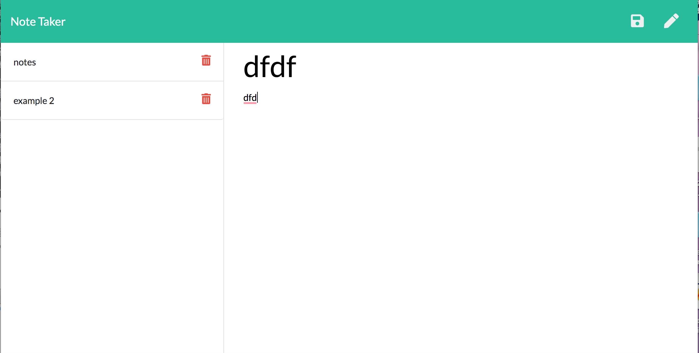

# NoteTaker
A notetaker app that allows you take notes and edit/delete reminders.

## License
NONE

## Table of Contents

* [ Description ](#Description)
* [ Installation ](#Installation)
* [ Usage Information ](#Usage-Information)
* [ Credits / Contributors ](#Credits-/-Contributors)
* [ Testing Procedures ](#Testing-Procedures)
* [ Questions? ](#Questions?)

## Description
This app allows you to take notes, save the notes, and delete as you please. 

## Installation 
Simply follow the link to the deployed app on heroku.

## Usage Information
Open the app in heroku and click "get started." Add a note by typing in the empty note and click the save botton to save the note. If you wish to delete the note, click the trash can next the specific note that you wish to delete. 

## Credits / Contributors

Thanks to my partner Elijah Flanders for working with me to create this. Also big thanks to github user 'imbingz' for her examples that were extremely helpful.

## Testing Procedures

Tested in terminal/vscode.

## Questions?

Check out my Github Profile at https://github.com/kyliemegan24

 

You can also email me at kyliemegan24@gmail.com.

